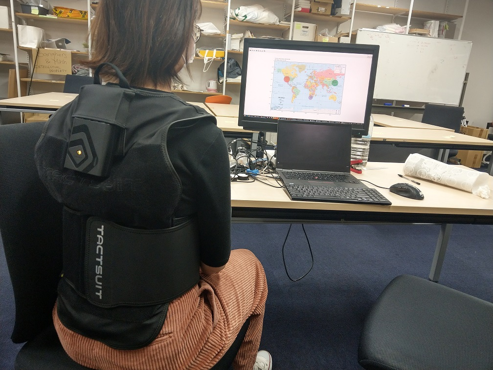
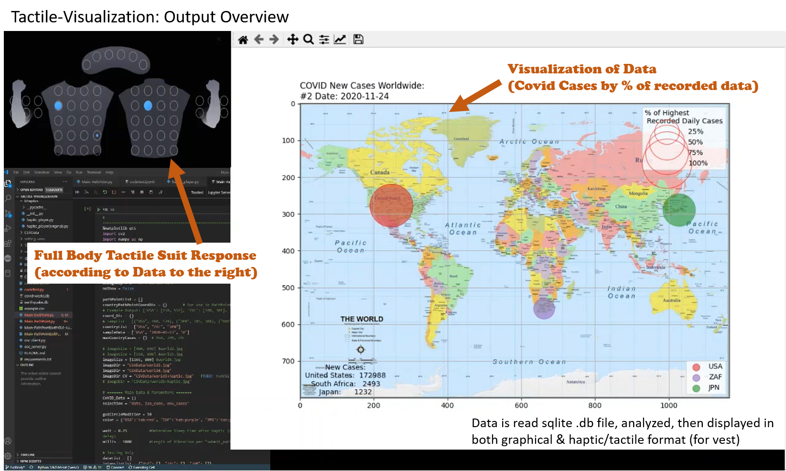
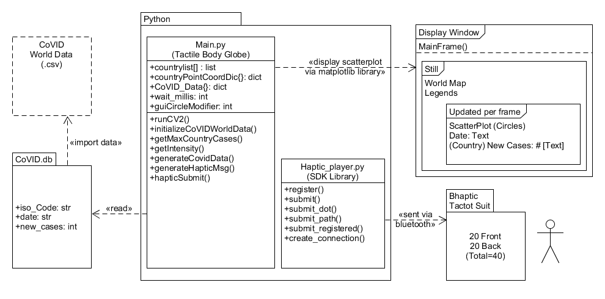

# Tactile-Visualization

Master's Research & Thesis on Haptic Design and Data Visualization.  
Explores the concept of using new "mediums" of Data Interpretation and Visualization in the form of Tactile Response.

    

Showcase Demo

    

 
 

---

# How it works
Large dataset is obtained online and stored into the sqlite .db for quick reading and analyzing. 
Data can then be sent and display in 2 modes:
1. Data Visualization via `matplotlib`
2. Haptic/Tactile Data Visualization (via Full Body Tactile Suit)

## User Interface (with Tactile Suit Visualizer for Debugging)

    

    
## Components of how it works

    

Haptic Suit and software used in this demo:
- B-Haptic Tactoc Suit
- Haptic Player & Communication Code with Tactile Suit (forked from https://github.com/bhaptics/tact-python)
---

# Other Functionality (and Preliminary Testing)
Other Data display using Tactile Response is also being explored, such as "column-mode" and "dot-point" mode.

Under this format, data is being displayed similar to "audio" file in temporal pattern from right to left, with "intensity" of tactile vibration correlating to the % of the data.

## Column Mode Data representation using Tactile Suit:

## Dot-Point Mode (Inital Testing) of parsing data and output with Intensity based on Highest % of data value within the set

---

<!-- 
---
# Video - Full Run Demo (normal speed)
(Due to recording program running, this doesn't reflect the actual runtime speed of the data). -->

